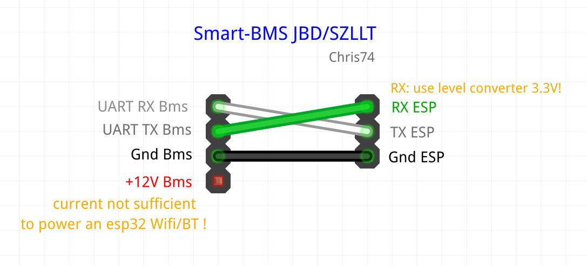
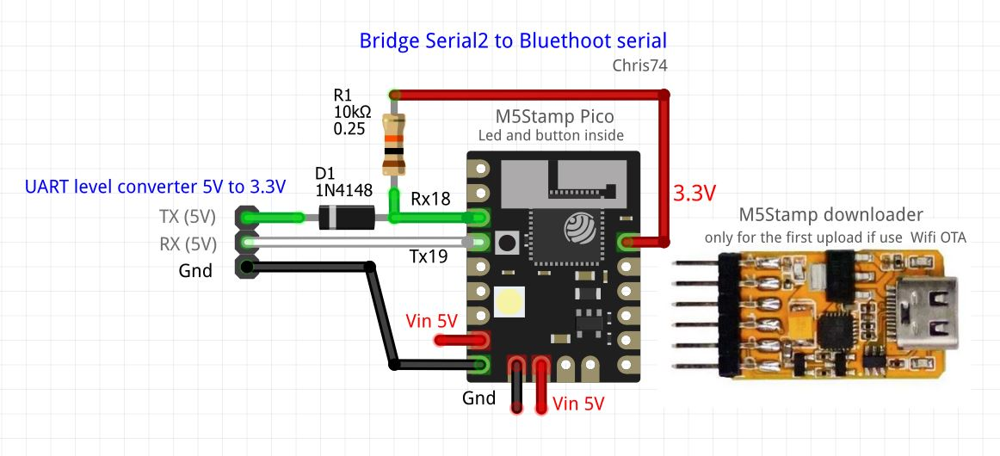
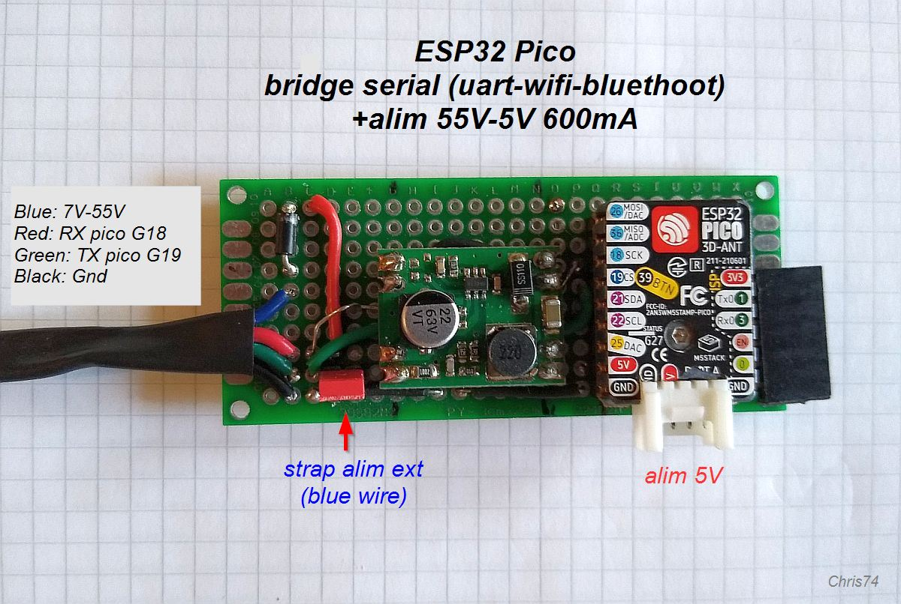
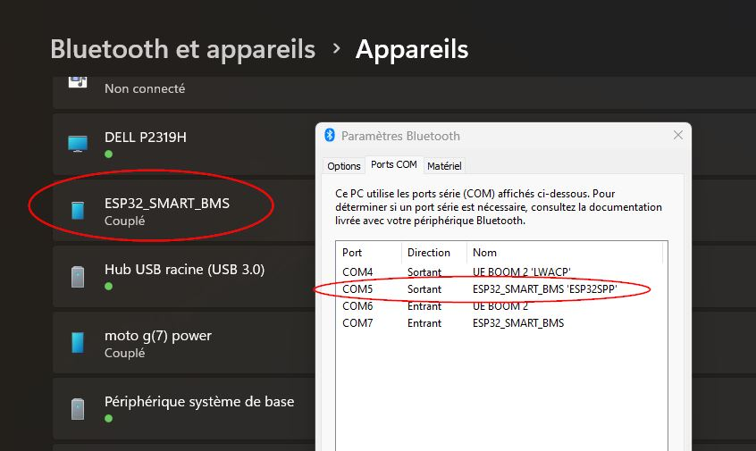
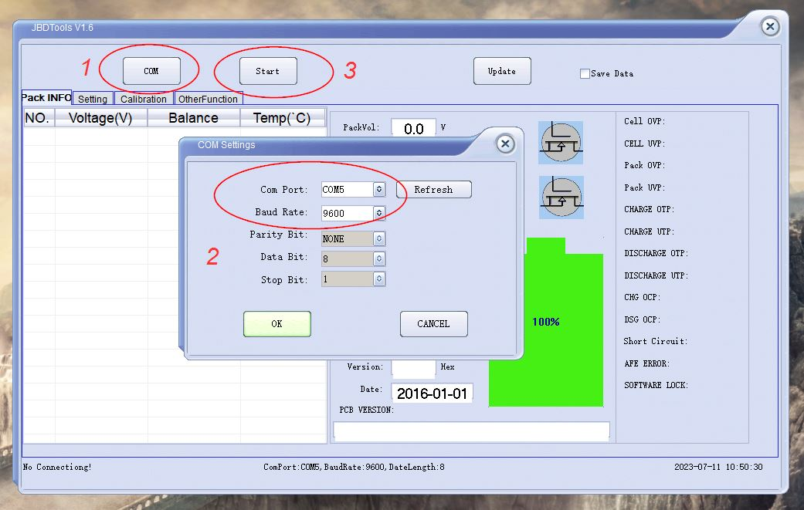

# ESP32 bridge Serial2 to Bluethoot serial

Simple sketch to replicate a Serial2 connection (hardware serial) on a bluethoot serial connection. For reliability the code uses buffers.

Application example for an e-bike battery with Smart-BMS SZLLT (same JBD or Xiaoxiang) and  PC app JBDtools.  
Work maybe also on Daly BMS with their PC soft ?? to be tested ...  
- Tested  with BMS SZLLT SP15S001-P13S-40A and JBDTools v.1.6

### Diagram

  

  

my M5Stamp pico circuit. You can also use any ESP2 dev!   
Adapt RX and TX pins accordingly.   
**Note:** The DC-DC 55V-5V module is not used here: The 12V of the Smart-BMS does not provide enough current to power my EP32 BT!   
I put a strap to disable it in this case but use it for other applications, like [Bafang BBS_config](https://github.com/Chris741233/BBS_config)

  

 

### How to use

On Windows associate the bluethoot device "ESP32_SMART_BMS" 
and locate the right com number ! (important) 

  

in the JBDtools application (or other) specify the same com number and Bd (9600).  
click OK then start, and then wait for the connection to be established.   
Can sometimes take a little time!  
If it doesn't work check your serial bluethoot com number.

  

